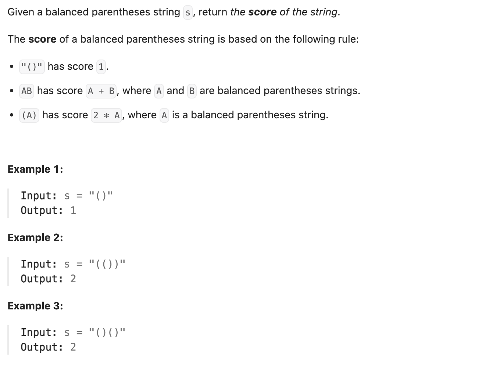

``` cpp
class Solution {
public:
    int scoreOfParentheses(string s) {
        int result = 0;
        int left = 0;

        // 找到每一对'()'，数贡献了多少层
        for (int i = 0; i < s.size(); i++) {
            if (s[i] == '(') {
                left++;
            }
            if (s[i] == ')') {
                if (s[i - 1] == '(') {
                    result += pow(2, left - 1);
                }
                left--;
            }
        }

        return result;
    }
};
```
