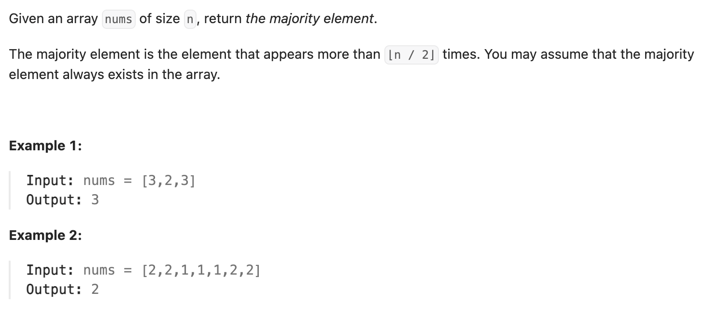

``` cpp
class Solution {
public:
    int majorityElement(vector<int>& nums) {
        // “一命抵一命，人数最多的那个肯定活到最后”
        // candidate：当前假定的众数
        int candidate = nums[0];

        // count：当前假定众数和其他数一抵一后剩下的个数
        int count = 1;

        for (int i = 1; i < nums.size(); i++) {
            if (count == 0) {
                candidate = nums[i];
                count += 1;
            }
            else {
                if (candidate == nums[i]) {
                    count += 1;
                }
                else {
                    count -= 1;
                }
            }
        }

        // 最后剩下的一定是众数
        return candidate;
    }
};
```
