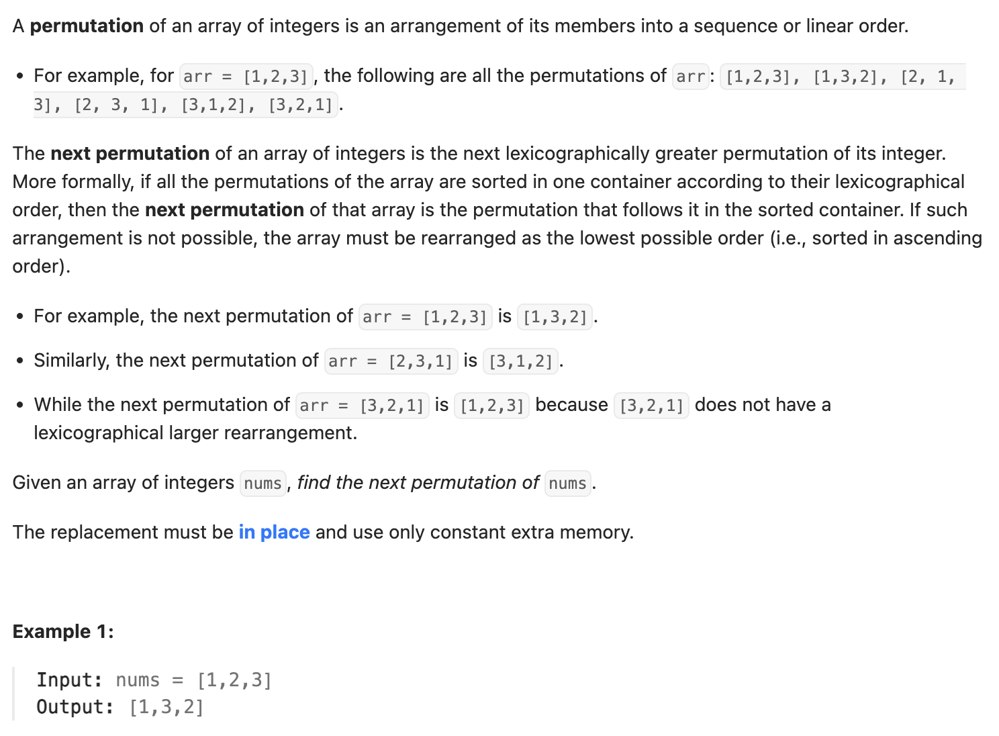

``` cpp
class Solution {
public:
    void nextPermutation(vector<int>& nums) {
        // 首先，从右往左找到第一个i，使得a[i] < a[i-1]
        int i = nums.size() - 2;
        while (i >= 0 && nums[i] >= nums[i + 1]) {
            i--;
        }

        // 如果i不是-1，就要找到从右往左第一个比它大的数，两者交换
        if (i >= 0) {
            int j = nums.size() - 1;
            while (j >= 1 && nums[j] <= nums[i]) {
                j--;
            }
            swap(nums[i], nums[j]);
        }

        // 交换后，i右边必然是倒序，排列回正序
        rearrange(nums, i + 1, nums.size() - 1);
    }

    // 把nums从第i位到第j位倒序排列，保证in place
    // 也就是手写板reverse
    void rearrange(vector<int>& nums, int left, int right) {
        while (left < right) {
            swap(nums[left], nums[right]);
            left++;
            right--;
        }
    }
};
```
