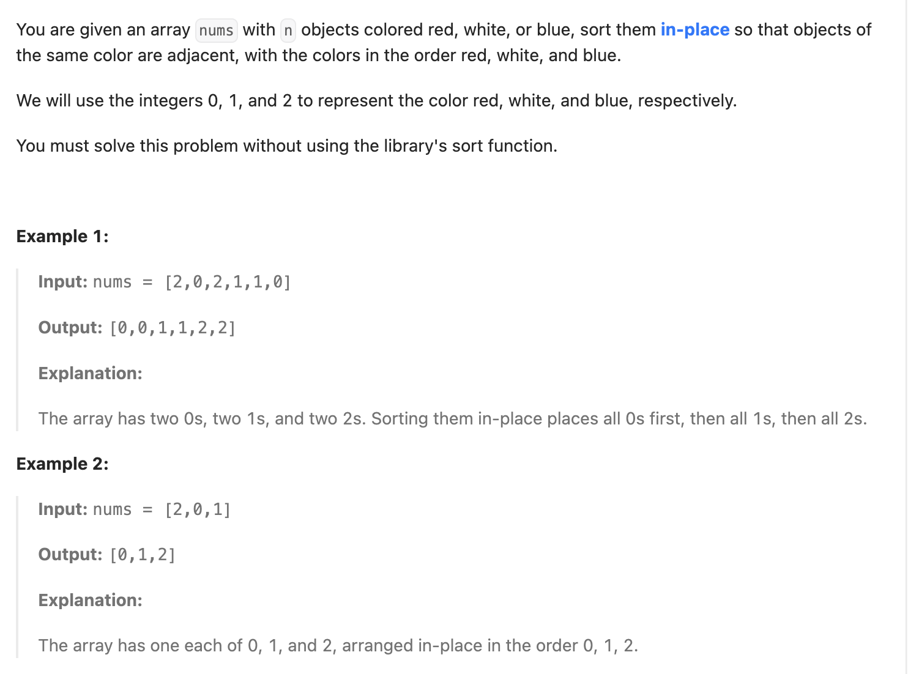

``` cpp
class Solution {
public:
    void sortColors(vector<int>& nums) {
        // 双指针
        // 左指针负责把每一个0移到前面
        // 右指针负责把每一个2移到后面
        int left = 0;
        int right = nums.size() - 1;

        // 遍历数组，找0和2
        // 注意：遇到 2 时，交换完之后不能让 i 前进，因为需要重新检查 nums[i]
        // 因为是从左往右交换过来的，left左边只会是0和1
        int i = 0;
        while (i <= right) {
            if (nums[i] == 0) {
                // 交换函数
                swap(nums[i], nums[left]);
                left++;
                i++;
            }
            else if (nums[i] == 2) {
                swap(nums[i], nums[right]);
                right--;
            }
            else {
                i++;
            }
        }
    }
};
```

还可以直接数0和1的个数，然后逐个替换。