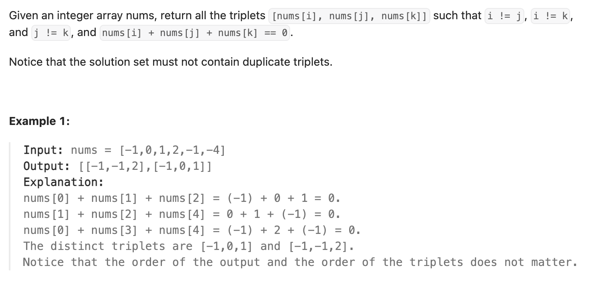

``` cpp
class Solution {
public:
    vector<vector<int>> threeSum(vector<int>& nums) {
        // 本质还是两数之和，只不过第一个数在变化
        // 思路就是，先固定一个数，然后另外两个数相遇变化，使得他们俩加起来复杂度是N
        // 这样复杂度就是N^2而不是N^3了（勇敢承认N^2复杂度吧）

        // 首先进行排序，才能确保另外两个数一个变大时另一个变小
        sort(nums.begin(), nums.end());

        vector<vector<int>> result;

        for (int i = 0; i < nums.size(); i++) {
            // 要对第一位数去重
            if (i > 0 && nums[i] == nums[i-1]) {
                continue;
            }

            int left = i + 1;
            int right = nums.size() - 1;
            int target = 0 - nums[i];

            while (left < right) {
                if (nums[left] + nums[right] == target) {
                    result.push_back({nums[i], nums[left],nums[right]});
                    // 确保left移动到了下一个不同的位置
                    while (left + 1 < right && nums[left + 1] == nums[left]) {
                        left ++;
                    }
                    left++;
                }
                else if (nums[left] + nums[right] < target) {
                    left ++; // 这里不用担心重复值
                }
                else {
                    right --;
                }
            }
        }

        return result;
    }
};
```
