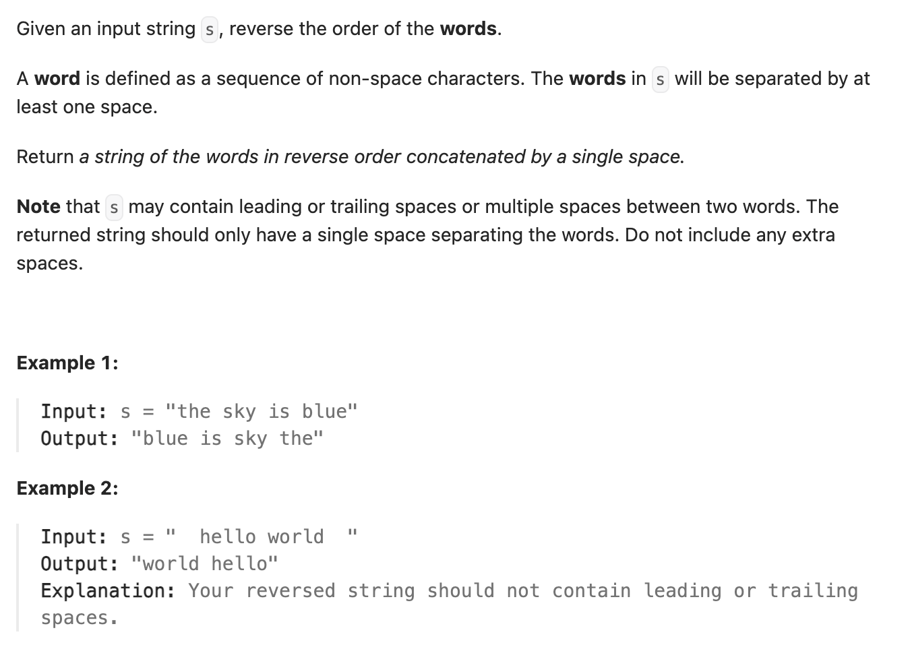

``` cpp
class Solution {
public:
    string reverseWords(string s) {
        // 去掉s开头的空格
        int start = 0;
        while (start< s.size() && s[start] == ' ') {
            start++;
        }
        s.erase(0, start);

        string result;
        int end = s.size() - 1;
        while (s[end] == ' ') {
            end--;
        }

        int left = end; // 从不是空格的最后一位开始
        int right = end;

        while (left >= 0) {
	        //到开头了，结束
            if (left == 0) {
                result += s.substr(left, right - left + 1);
                break;
            }
            // left找到字符边界了
            else if (s[left] != ' ' && s[left - 1] == ' ') {
                result += s.substr(left, right - left + 1);
                result += " ";
                left--;
                while (s[left] == ' ') {
                    left--;
                }
                right = left;
            }
            // left没找到边界
            else {
                left--;
            }
        }

        return result;
    }
};
```
