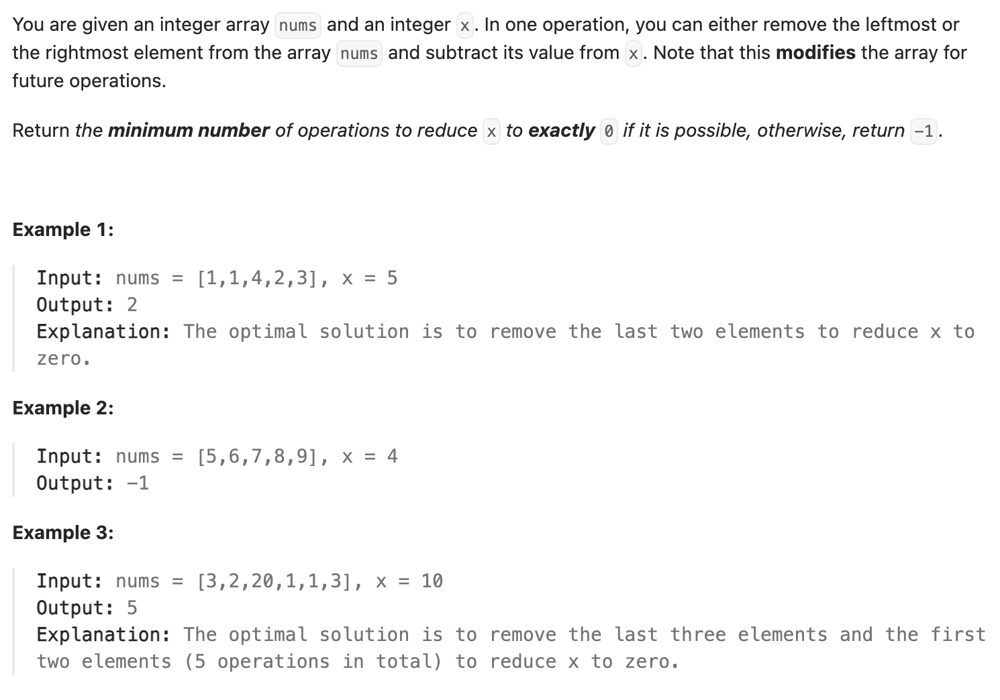

``` cpp
class Solution {
public:
    int minOperations(vector<int>& nums, int x) {
        // 找出和为totalSum-x的最长子字符串
        int totalSum = 0;

        for (int num : nums) {
            totalSum += num;
        }

        int sum = totalSum - x;

        if (sum == 0) {
            return nums.size();
        }

        int left = 0;
        int right = 0;
        int maxLength = 0;
        int currSum = nums[0];

        while (right < nums.size() && left < nums.size()) {
            if (right == nums.size() - 1) {
                if (currSum < sum) {
                    break;
                }
            }
            if (currSum < sum) {
                right++;
                currSum += nums[right];
            }
            else if (currSum > sum) {
                currSum -= nums[left];
                left++;
            }
            else {
                maxLength = max(maxLength, right - left + 1);
                right++;
                currSum += nums[right];
            }
        }

        if (maxLength == 0) {
            return -1;
        }
        else {
            return nums.size() - maxLength;
        }

    }
};
```
