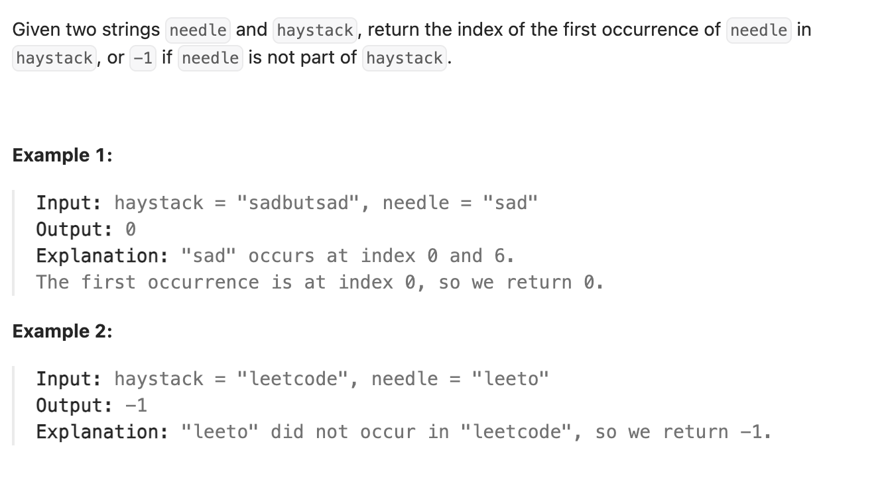

``` cpp
class Solution {
public:
    int strStr(string haystack, string needle) {
        // KMP算法
        // 给匹配串的每一位找到属于它的前后缀最大相同数量
        // 因为既然能够匹配到它，就说明原串这一部分是和它一样的
        // 比如aabaaab，如果aabaa是匹配的，那最大相同数量是2(aa)
        // 所以next[4] = 2

        vector<int> next(needle.size(), 0); // 存每一位的前后缀最大相同数量
        int i = 0;
        for (int j = 1; j < needle.size(); j++) {
            // 我本来有长度 i 的公共前后缀
            // 现在想加入 needle[j]，但发现接不上
            // 那就把当前公共前后缀缩短，尝试「次长的公共前后缀」
            while (i > 0 && needle[i] != needle[j]) {
                i = next[i - 1];
            }
            if (needle[i] == needle[j]) {
                i++;
            }
            next[j] = i;
        }

        int b = 0;
        // haystack一直往前走，调整指向needle的位置来匹配haystack
        for (int a = 0; a < haystack.size(); a++) {
            while (b != 0 && haystack[a] != needle[b]) {
                b = next[b - 1]; // 因为知道0 ~ b-1一定是匹配的
            }
            if (haystack[a] == needle[b]) {
                b++;
            }
            if (b == needle.size()) {
                return a - needle.size() +1;
            }
        }

        return -1;

    }
};
```
