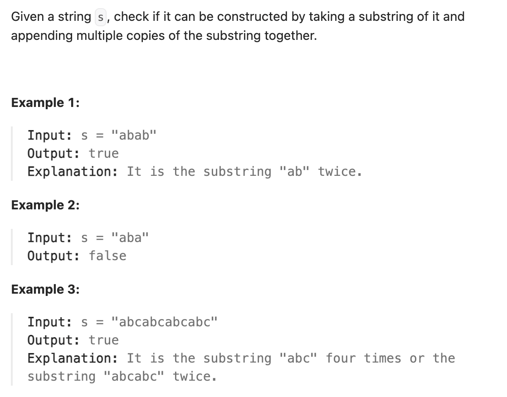

``` cpp
class Solution {
public:
    bool repeatedSubstringPattern(string s) {
        // KMP算法
        // 制作next数组，给匹配串的每一位找到属于它的前后缀最大相同数量
        // 最长相等前后缀不包含的子串的长度只要被字符串s的长度整除，
        // 最长相等前后缀不包含的子串一定是最小重复子串。

        vector<int> next(s.size(), 0);
        int i = 0;
        for (int j = 1; j < s.size(); j++) {
            while (i != 0 && s[j] != s[i]) {
                i = next[i - 1];
            }
            if (s[j] == s[i]) {
                i++;
            }
            next[j] = i;
        }

        int sub = s.size() - next[s.size() - 1];
        if (next[s.size() - 1] != 0 && s.size() % sub == 0) {
            return true;
        }

        return false;
    }
};
```
